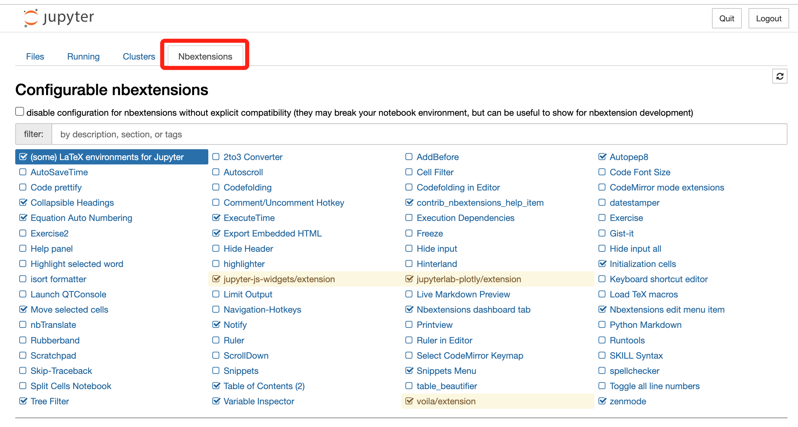
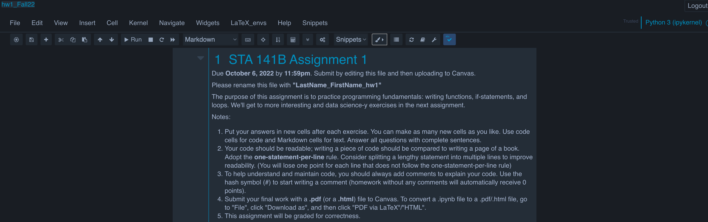

# Configurations

- [Configurations](#configurations)
  - [Jupyter Notebook](#jupyter-notebook)
    - [Extensions](#extensions)
    - [Jupyter Notebook Theme](#jupyter-notebook-theme)
    - [Convert to PDF](#convert-to-pdf)
      - [LaTex - PDF （推荐使用latex因为效果更好）](#latex---pdf-推荐使用latex因为效果更好)
      - [HTML -> PDF （建议不要使用暗色系主题要不然导出的pdf会出现output看不见的情况）](#html---pdf-建议不要使用暗色系主题要不然导出的pdf会出现output看不见的情况)

## Jupyter Notebook

### Extensions

```bash
pip install jupyter_contrib_nbextensions
```
如果你是直接下载了ananoca直接将`pip`替换成`conda`, 如果有其他报错可以检查一下环境。



可以自己喜欢的插件，也可以直接编译器写。

### Jupyter Notebook Theme

https://github.com/dunovank/jupyter-themes

```bash
pip install jupyterthemes
jt -t <theme name>
```

个人设置:
```bash
jt -t chesterish -T -N  -f roboto -fs 11
```




### Convert to PDF
#### LaTex - PDF （推荐使用latex因为效果更好）

1. Download Pandoc: https://pandoc.org/installing.html
2. Download MiKTeX: https://miktex.org/download

#### HTML -> PDF （建议不要使用暗色系主题要不然导出的pdf会出现output看不见的情况）

```bash
pyppeteer-install
```
OR
```bash
pip install pyppeteer
```

**Additional materials**:

> **Note:**
>
> Markdown and LaTex in Jupyter Notebook: [Link](https://towardsdatascience.com/write-markdown-latex-in-the-jupyter-notebook-10985edb91fd)

---